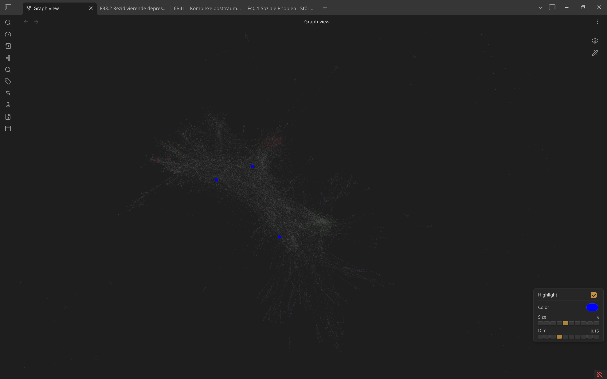

# Open Notes Graph Highlight

An [Obsidian](https://obsidian.md) plugin that visually highlights currently open notes in the graph view.

## Features

- **Color highlight** — open notes appear in a custom color
- **Size boost** — open notes are enlarged to a fixed size, independent of link count
- **Dim other nodes** — non-open notes are faded out so open notes stand out
- **Highlight linked notes** (optional) — notes directly linked to an open/pinned note are tinted in the same color at reduced opacity, so you can spot neighbors without confusing them for open notes
- **Highlight edges** (optional) — edges connecting to an open/pinned note are tinted in that note's color, the same effect Obsidian applies when you hover a node in the graph
- **In-graph control panel** — adjust color, size, and opacity directly in the graph view without opening settings

## Installation

### Via Community Plugins (recommended)

1. Open Obsidian Settings → Community Plugins
2. Disable Safe Mode if prompted
3. Click **Browse** and search for **Open Notes Graph Highlight**
4. Click **Install**, then **Enable**

### Manual installation

1. Download `main.js` and `manifest.json` from the [latest release](https://github.com/4Cjyxbq25Cb/obsidian-open-notes-highlight/releases/latest)
2. Create a folder `open-notes-graph-highlight` inside your vault's `.obsidian/plugins/` directory
3. Copy both files into that folder
4. Reload Obsidian and enable the plugin in Settings → Community Plugins

## Usage

1. Open the **Graph View**
2. Open one or more notes in Obsidian
3. The open notes will immediately appear highlighted in the graph

A small **control panel** appears in the bottom-right corner of the graph view for quick adjustments.

## Settings

| Setting | Description | Default |
|---|---|---|
| **Highlight color** | Color used to highlight open notes | `#e06c75` (red) |
| **Node size** | Fixed visual size of open notes (normal nodes: ~2–3) | `8` |
| **Dim opacity** | Opacity of non-open nodes (0 = invisible, 1 = normal) | `0.15` |

All settings are also accessible directly in the graph view via the control panel.

## Compatibility

- Obsidian 1.4.0 and later
- Works on desktop and mobile

## License

MIT
